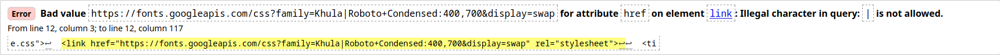

# Newsweek Bootstrap Project

The main goal of this project is for the student to learn the use of a CSS framework, particularly Bootstrap in this case.

The student may use custom CSS to style some parts, but has to use Bootstrap classes as much as possible to duplicate [Newsweek](https://www.newsweek.com/) website.

### Requirements:
- [The Odin's project requirements](https://www.theodinproject.com/courses/html5-and-css3/lessons/using-bootstrap)
- [Microverse's requirements](https://microverse.pathwright.com/library/fast-track-curriculum/69047/path/step/65938290/)

### Technologies Used

The main technologies used in this project were HTML, CSS and [Bootstrap](https://getbootstrap.com/). Additional elements used:

  - [Fontawesome](https://fontawesome.com/) to place and style icons used in the project.
  - [Google fonts](https://fonts.google.com/) to make the page look as similar as possible to the original one.

### Live Previews:
- [Development](https://raw.githack.com/alvp01/Newsweek-bootstrap-project/feature-branch/index.html)
- [Production](https://rawcdn.githack.com/alvp01/Newsweek-bootstrap-project/d5f0a356a9dd74766167ceceabb52b8a20cbb7fb/index.html)

### Important Notes:

1. The only error remaining in the validator is one related to the Google fonts file, specifically the URL to import the fonts, changing that will affect the final appearance of my project. I really hope this "error" doesn't affect the review status.

2. I made project based on how the original page looks in my screen resolution (1980px wide), it looks a little different on smaller screens, the page body may look wider on a narrower screen; the layout is the same nonetheless.

- **Original page look:**

3. When you check original page on an actual mobile device, you will notice there are some sections that are not displayed, from the U.S to the Sport sections, but you can still check those sections in the responsive emulator on a desktop, that's why those section may look weird in the responsive mode.

4. Sometimes the page may take long to load properly using the githack links.

### Developer
[Abel](https://github.com/alvp01)
